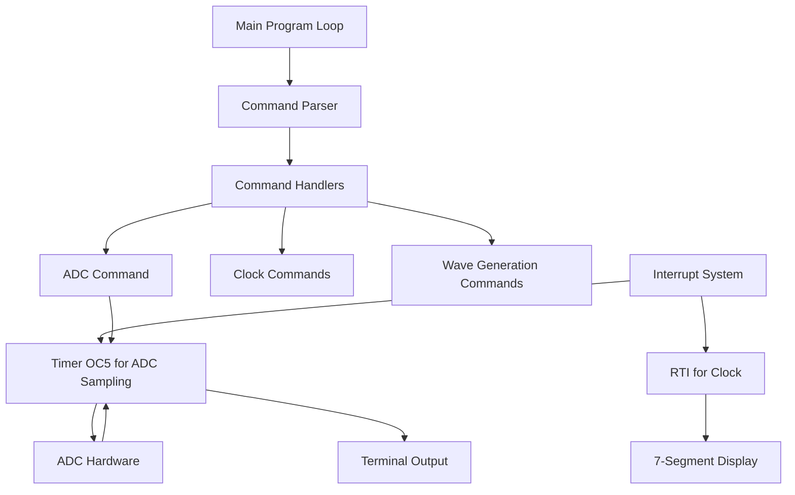
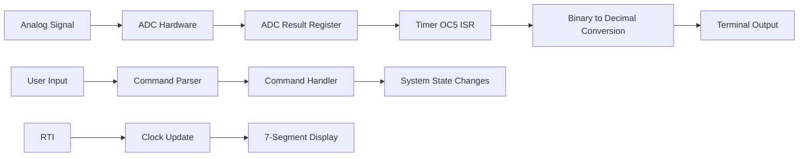

# System Patterns

## System Architecture
The system follows a command-driven architecture with interrupt-based timing and I/O operations:

## Core Design Patterns

### Command Pattern
- User input is processed as commands ('adc', 't', 'gw', etc.)
- Each command has a dedicated handler function
- Command parser validates format before execution
- Error handling for invalid commands

### State Machine
- System maintains state flags for various operations
- ADC_ACTIVE flag indicates ADC sampling in progress
- State transitions manage mode changes
- Prevents conflicting operations

### Interrupt-Driven Processing
- RTI manages clock with 1-second updates
- Timer OC5 manages ADC sampling at 8kHz
- Prioritized interrupt handling
- Non-blocking operation for UI responsiveness

### Producer-Consumer Pattern
- ADC interrupt produces sample data
- Terminal output consumes and displays data
- Timing-critical operation management
- Buffer management if needed

## Critical Components

### ADC Subsystem
- 8-bit single conversion mode
- Channel 7 input for analog signal
- Timer-driven sampling at precise 8kHz rate
- 2048 samples per acquisition cycle

### Timing System
- RTI for 1-second clock updates
- Timer OC5 for 125μs ADC sampling
- Precise timing critical for proper signal representation

### User Interface
- Terminal-based command input
- Decimal output format for ADC values
- 7-segment display for clock visualization
- Error message system for user feedback

## Data Flow

## Integration Patterns

### Module Initialization
- ADC initialization at startup
- Timer configuration but interrupt disabled until needed
- Command handlers registered with parser

### Command Execution
- Valid commands trigger specific handlers
- 'adc' command initiates sampling sequence
- State management prevents conflicting operations

### Interrupt Coordination
- Multiple interrupt sources (RTI, Timer OC5) coexist
- Prioritization to maintain real-time operation
- Critical sections protected as needed

### Error Handling
- Command format validation
- Hardware initialization checks
- Timeout mechanisms for hardware operations
- Recovery procedures for error conditions 